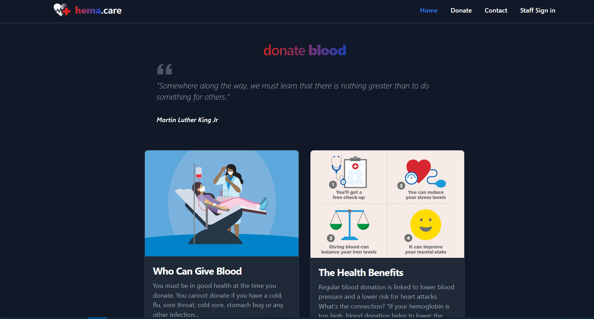
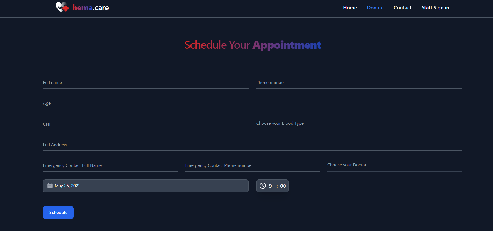
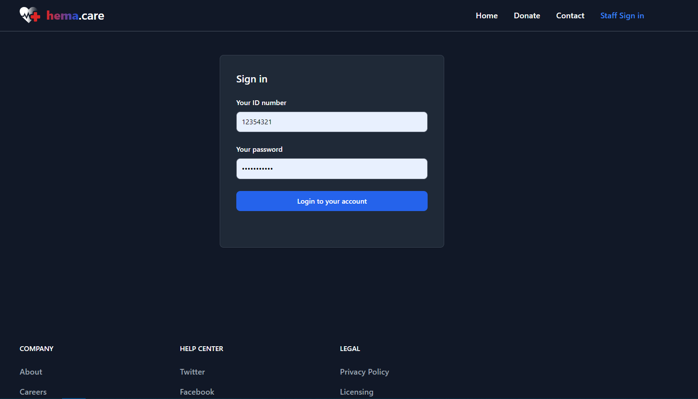
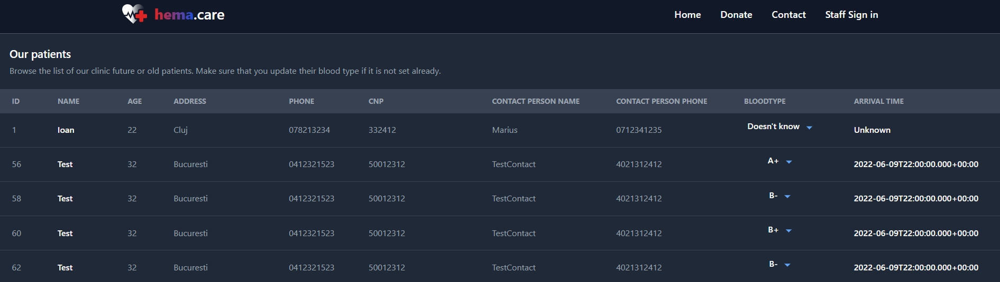
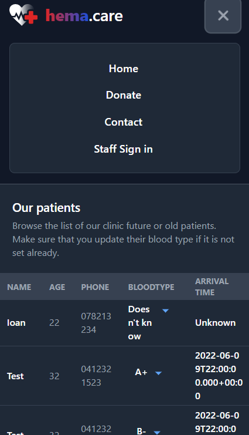

# Blood Clinic UI
This is the frontend application of the BloodClinic **fullstack** app.
This frontend application was made in react native, using TypeScript, HTML and CSS.
The app works fully on **mobile** also.

## Description
The app was intended for people that want to donate blood, at a flexible time. Each user can enter the Donation page and enter his information and choose his desired schedule time. Then, if he desires, he can also donate to different charities, any ammount he wants. 
Also, the medical staff can login into the site and see all the patients that were registered and scheduled. They can modify the blood type (after the donation) of each patient in case a patient does not know his blood type.

## Pages
 - **Contact:** Feedback page.
 - **Donate:** Page used for scheduling the blood donation appointments and for donation to charities.
 - **Home:** General home page, with important health information.
 - **Not-found:** Not found page, prompted when accessing an invalid url.
 - **Patients:** The page where the medical staff can view all the patients and modify their blood type.
 - **Staff Sign in:** The page where the medical staff can sign in into the website.

## Screenshots

